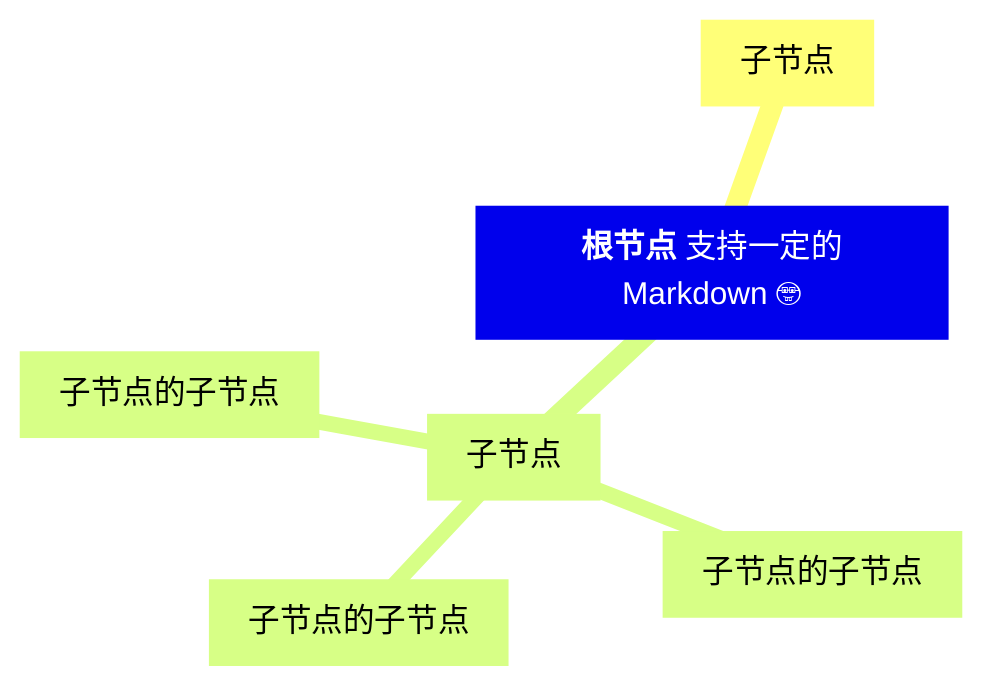
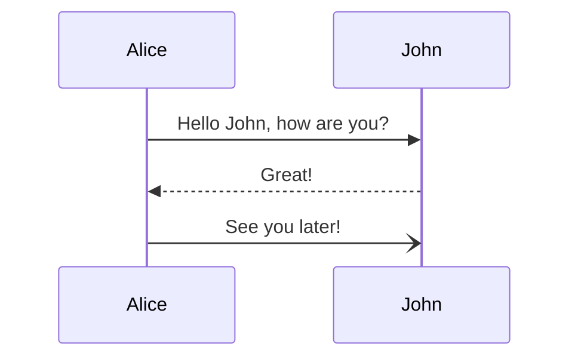
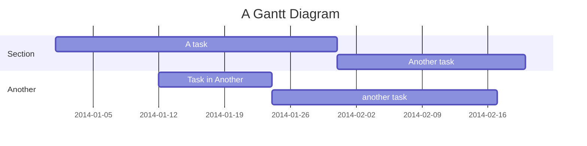
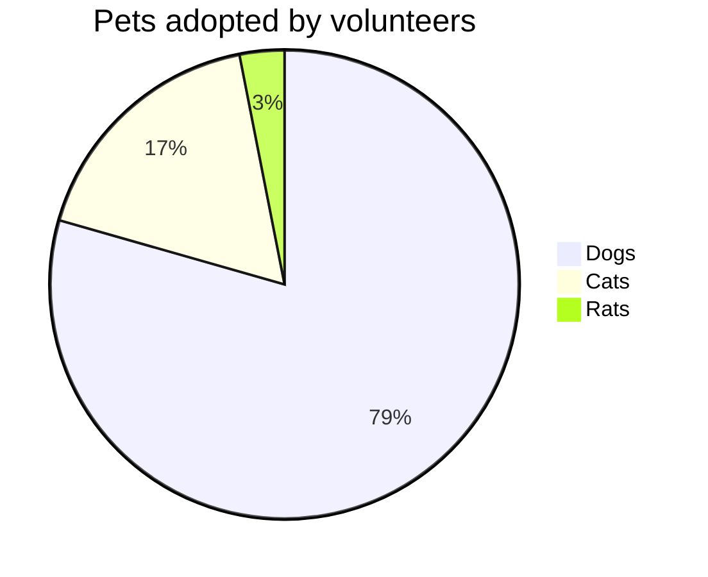
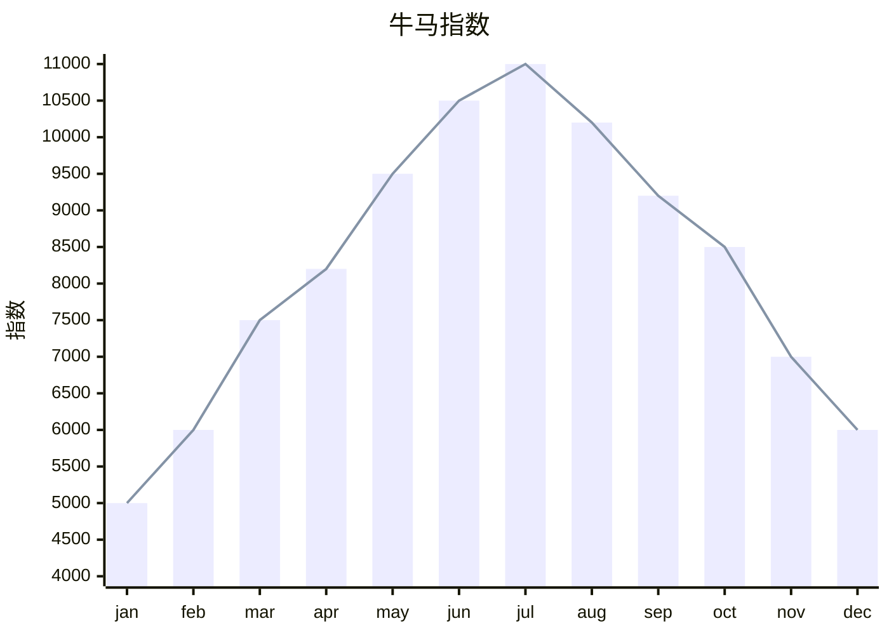
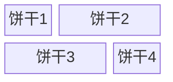
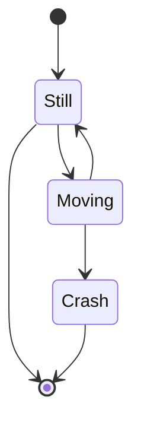

**颜色文字:**
<span style="color:red">红色文字</span>
<span style="color:blue">蓝色文字</span>
<span style="color:#ff0000">另一种红色</span>
<span style='color:orange; font-weight:bold'>加粗橘色</span>
$\color{red} x^2 + \color{blue} y^2 = 1$
```text
只要查一下颜色的编号放进去就可以
<span style="color:red">红色文字</span>
<span style="color:blue">蓝色文字</span>
<span style="color:#ff0000">另一种红色</span>
<span style='color:orange; font-weight:bold'>加粗橘色</span>

数学公式中的颜色文字（虽然大概用不到就是了）
$\color{red} x^2 + \color{blue} y^2 = 1$
```


**章节符号** §
或者这样子 $\S$ `$\S$`

**任务表格**：
- [ ] abc
- [x] def
- [?] asdf
```text
- [ ] abc
- [x] def
- [?] asdf
```


**居中输入**
<div style="text-align: center;">这段文字将居中显示</div>
```text
<div style="text-align: center;">这段文字将居中显示</div>
```

**放大**
<div style='font-size:20px'>这段文字将放大</div>
<span style="font-size: 12px">12px - 小号</span>
<span style="font-size: 14px">14px - 默认大小</span>
<span style="font-size: 16px">16px - 稍大</span>
<span style="font-size: 18px">18px - 大号</span>
<span style="font-size: 20px">20px - 较大</span>
<span style="font-size: 24px">24px - 标题大小</span>
<span style="font-size: 32px">32px - 醒目标题</span>
```text
<div style='font-size:20px'>这段文字将放大</div>
<span style="font-size: 12px">12px - 小号</span>
<span style="font-size: 14px">14px - 默认大小</span>
<span style="font-size: 16px">16px - 稍大</span>
<span style="font-size: 18px">18px - 大号</span>
<span style="font-size: 20px">20px - 较大</span>
<span style="font-size: 24px">24px - 标题大小</span>
<span style="font-size: 32px">32px - 醒目标题</span>
```

# Mermaid
参考：[Mermaid 参考](https://docs.min2k.com/zh/mermaid/syntax)
Obsidian支持 Mermaid 图表，思维导图（但是很丑）：

时序图：


甘特图：

饼图

统计图


饼干图

何意味：

目前正在研究如何使其变得更美观。


>[!quote] Cym10x
>666把 Obsidian 沙盒搬进来了

>[!quote] WKN
>666你上课在做这个东西 $\uparrow$

