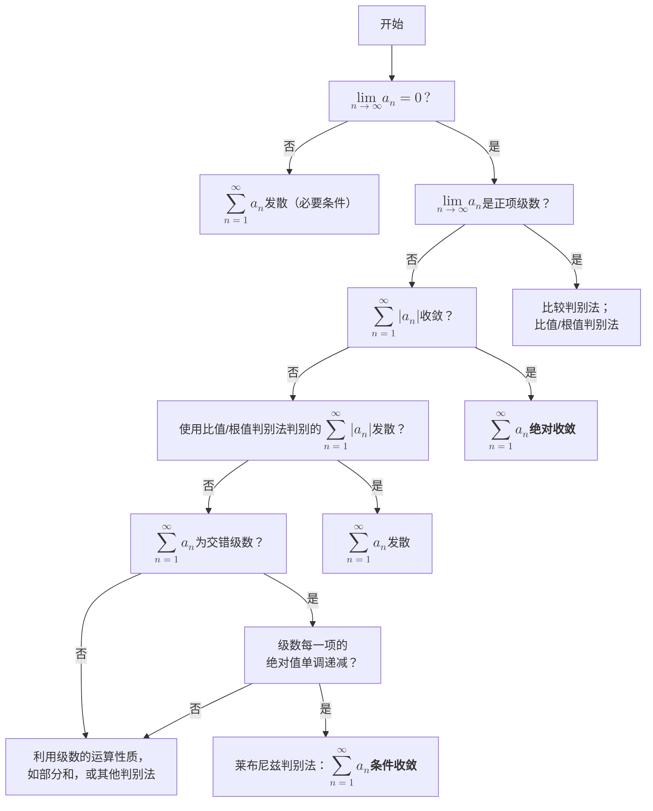

学高数者，诚能见等价，则思加减不能替；将有洛，则思代换以化简；念复合，则思勿漏层而求导；惧积分，则思不定以加C；乐微分，则思dx而莫忘；忧定积，则思牛莱而相减；虑换元，则思积分上下限；惧级数，则思判别勿用错；项所加，则思无因忽以谬导；拐所及，则思无因x而漏y。总此十思，宏兹九章，简能而任之，择善而从之，则牛顿尽其谋，莱氏竭其力，泰勒播其惠，柯西效其忠。文理争驰，学生无事，可以尽春节之乐，可以养寒假之寿。

# 逐句解析
##### 学高数者，诚能见等价，则思加减不能替；
等价无穷小的替换不能出现在加减法中。如果一定需要进行加减法，请改用**泰勒展开**，并留意泰勒展开的程度，你需要根据皮亚诺余项来判断需要展开到多少阶。
##### 将有洛，则思代换以化简；
准备用洛必达的时候，先考虑能不能用等价代换来化简式子，减小求导的压力；
##### 念复合，则思勿漏层而求导；
在进行复合函数求导时，分层求导一定要彻底，不能漏掉某一层：
$f(g(h(x)))=f'(g(h(x)))·g'(h(x))·h'(x)$
##### 惧积分，则思不定以加C
>[!error] 考试必考点！补药漏写常数 C 口牙！
##### 乐微分，则思dx而莫忘；
>[!error] 考试必考点！补药漏写微分算子 dx 口牙！
##### 忧定积，则思牛莱而相减；
定积分的牛顿-莱布尼兹公式
##### 虑换元，则思积分上下限；
在定积分的换元时，注意上下限有没有一并换好！
##### 惧级数，则思判别勿用错；
级数的判别需要按照以下步骤执行：

>[!error] 非正项级数需要写明“绝对收敛”和“条件收敛”！
##### 项所加，则思无因忽以谬导；
在求导的时候，观察好每一项！不要漏掉了什么
##### 拐所及，则思无因x而漏y。
>[!error] 考试必考点！拐点是一个二维的点！！而零点、驻点等是一个一维的 $x$ 值！
##### 总此十思，宏兹九章，简能而任之，择善而从之，则牛顿尽其谋，莱氏竭其力，泰勒播其惠，柯西效其忠。文理争驰，学生无事，可以尽春节之乐，可以养寒假之寿。
只要易错点不错，你就放心去考吧，我们已经帮你找好关系了——找的是牛顿、莱布尼兹、泰勒和柯西，我说服了他们往你的大脑注入一点他们的智慧，考试当天生效。
最后提前祝大家过个好年！ 
